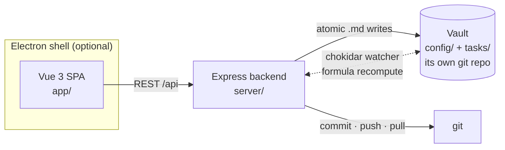

# Basalt

[Português (Brasil)](README.md) · **English**

[](https://github.com/JairAragao/basalt/actions/workflows/ci.yml)
[](LICENSE)
[](https://github.com/JairAragao/basalt/releases)

A **git-native, local-first kanban**: every task is a plain `.md` file versioned in git.
No database, no cloud, no login. Markdown in, board out.

<!-- TODO: screenshot -->

> **Why "Basalt":** when lava cools slowly, the rock cracks into straight, stacked
> columns (columnar jointing) — the same geometry as a kanban board. And it is a dark
> stone, as a tool you stare at all day should be.

**Core principle:** the source of truth is plain text in git. The **engine is generic**;
your data lives in a separate **vault** (a folder with its own git repo). Editing a task
in the UI, in your text editor, or via a script all converge to the same `.md` file —
and every change becomes a descriptive git commit, automatically.

## Features

- **Kanban + table view** — macro groups × stages, drag and drop, per-property sorting,
  editable filters, colored columns. Stages can be renamed/recolored/added inline on the board.
- **Notion-style peek** — side / center / full modes, rich-text body editor (TipTap) with
  slash commands, selection toolbar and full markdown round-trip.
- **Formula fields** — Notion-style computed properties (`{type: 'formula', expression}`),
  recalculated by a file watcher. Safe evaluation (`expr-eval-fork`, no `eval`).
- **Multi-vault tabs** — work on several vaults (projects) in Obsidian-style tabs; each
  vault keeps its own config, tasks and git history.
- **User roster** — a versioned `config/users.json` plus a stable per-machine identity;
  assign tasks with a `user`-typed property. Still no login — identity comes from git.
- **Pull notifications** — after a pull, commits by other authors touching tasks you are
  responsible for become local notifications.
- **Reports dashboard** *(new in 0.5.0)* — created / completed / open counts, average lead
  time, a created×completed time series, and breakdowns by user and by any enum property.
  Aggregated entirely client-side.
- **Completion semantics** *(new in 0.5.0)* — mark one status group as the "done" group;
  the engine stamps `completed_at` / `completed_by` automatically when a task crosses into
  it (and clears them when it leaves). Audit fields, never editable by hand.
- **Per-card history + diff** — every change is a git commit with an automatic, descriptive
  message in plain language; inspect before/after per card.
- **Desktop app** — Electron shell reusing the same backend, with native folder picker,
  frameless dark window and installers for Win/Mac/Linux.

## The three repositories

| Repo | What it is |
|---|---|
| **basalt** (this one) | The engine/app. Ships **empty** — just what is needed to install and configure. |
| **basalt-vault** | A **data vault**: `config/` + `tasks/` (your tasks), versioned separately.

## Quickstart

Requirements: **Node ≥ 18** (see `.nvmrc`, recommended 20) and **git** on your PATH
(the backend commits/pushes via `simple-git`).

```bash
git clone https://github.com/JairAragao/basalt.git
cd basalt
npm install

# web (dev, HMR)
npm run dev          # backend :4317 + Vite :5173 (proxy /api)
# open http://localhost:5173

# desktop (Electron)
npm run electron:dev    # builds the front and opens the desktop app
npm run electron:build  # installer in release/ (Win .exe / Mac .dmg / Linux .AppImage)

# production web
npm run build        # outputs app/dist
npm start            # serves app/dist + API

npm test             # Vitest (server + front unit tests)
```

On first run the app opens the **Setup Wizard**: pick (or create) your **vault** folder.
That is where `config/` + `tasks/` are seeded and read from.

## Architecture (short version)



- The **engine** (this repo) is 100% generic — no customer-specific rules. Behavior is
  driven by the vault's declarative config (`schema.json`, `board.json`).
- Every write is **atomic** (`.tmp` + rename) and **path-safe**; every CRUD operation
  produces an awaited git commit with an automatic message, plus a background push.
- The **watcher** recomputes formula fields, is loop-proof, and **never commits**.

Full details (canonical save flow, invariants, module map, known edge cases):
[docs/ARCHITECTURE.en.md](docs/ARCHITECTURE.en.md).

## A task is a file

```markdown
---
id: T-20260601-my-task
titulo: My task
status: Em andamento
created_at: 2026-06-01T12:00:00.000Z   # audit — system-managed
created_by: jair
updated_at: 2026-06-10T18:30:00.000Z
updated_by: jair
completed_at: 2026-06-10T18:30:00.000Z # stamped when the task enters the done group
completed_by: jair
---
Free markdown body. Checklists, links, anything.
```

- `id` = file name, generated from `idPrefix + date + slug(title)`.
- Audit fields (`created_*`, `updated_*`, `completed_*`) are stamped by the engine —
  the UI never writes them. The author is the **git identity** (local-first, no accounts).
- `config/schema.json` defines properties and types (`string`, `enum`, `int`, `formula`,
  `datetime`, `user`); `config/board.json` defines groups, stages, colors, card layout,
  sorting, filters and the **done group** (`doneGroupId`).

## REST API (`/api`)

Config and vaults:
`GET /config` (includes derived `doneStageIds`) · `GET|POST /vault` · `GET /vaults` ·
`POST /vaults/switch` · `DELETE /vaults` · `GET /fs/list`

Tasks:
`GET /tasks` · `GET|PUT|DELETE /tasks/:id` · `POST /tasks` · `PATCH /tasks/:id/move` ·
`GET /tasks/:id/history` · `GET /tasks/:id/diff`

Board and schema:
`GET /board` · `PUT /board/status` (accepts `doneGroupId`) · `PUT /board/filters` ·
`PUT /board/card` · `PUT /schema/properties`

Users and notifications:
`GET /users` · `PUT /users/:id` · `GET /me` · `POST /users/register` ·
`GET /notifications` · `POST /notifications/clear`

Sync and assets:
`POST /sync/pull` · `GET /health/git` · `POST /assets` · `GET /assets/:name`

## Roadmap

Honest list — none of this is started yet:

- **Plugins / presets** — today extensibility is the declarative config; next step is
  one-click field presets (e.g. a GUTE prioritization preset) built on `PUT /schema/properties`.
- **Code signing** — installers are unsigned; SmartScreen/Gatekeeper warn on first run.
- **Auto-update** — `latest.yml` is generated but `electron-updater` is not wired;
  updating is manual (install over the previous version).

Out of scope by design: auth, multi-user servers, a database — Basalt is local-first.

## Contributing

See [CONTRIBUTING.en.md](CONTRIBUTING.en.md) (setup, tests, gotchas, the engine↔vault golden
rule). Please also read the [Code of Conduct](CODE_OF_CONDUCT.md) and
[SECURITY.md](SECURITY.md) for vulnerability reports.

## License

[MIT](LICENSE) © 2026 Jair Aragão
