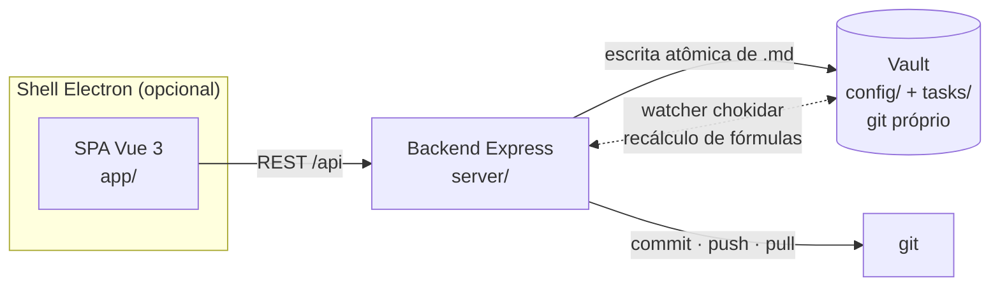

# Basalt

**Português (Brasil)** · [English](README.en.md)

[](https://github.com/JairAragao/basalt/actions/workflows/ci.yml)
[](LICENSE)
[](https://github.com/JairAragao/basalt/releases)

Um **kanban git-native e local-first**: cada tarefa é um arquivo `.md` puro versionado
no git. Sem banco de dados, sem nuvem, sem login. Markdown entra, quadro sai.

<!-- TODO: screenshot -->

> **Por que "Basalt":** quando a lava esfria devagar, a rocha racha em colunas retas e
> empilhadas (junção colunar) — a mesma geometria de um kanban. E é uma pedra escura,
> como deve ser uma ferramenta usada o dia inteiro.

**Princípio central:** a fonte da verdade é texto plano em git. O **engine é genérico**;
seus dados vivem num **vault** separado (uma pasta com git próprio). Editar uma tarefa
na UI, no seu editor de texto ou via script converge pro mesmo `.md` — e toda mudança
vira um commit git descritivo, automaticamente.

## Funcionalidades

- **Kanban + tabela** — grupos macro × etapas, drag and drop, ordenação por qualquer
  propriedade, filtros editáveis, colunas coloridas. Etapas podem ser renomeadas/
  recoloridas/adicionadas direto no board.
- **Peek estilo Notion** — modos side / center / full, editor de corpo rich-text (TipTap)
  com comandos de barra, toolbar de seleção e round-trip completo de markdown.
- **Campos de fórmula** — propriedades computadas estilo Notion
  (`{type: 'formula', expression}`), recalculadas por um watcher de arquivos.
  Avaliação segura (`expr-eval-fork`, sem `eval`).
- **Multi-vault em abas** — trabalhe em vários vaults (projetos) em abas estilo Obsidian;
  cada vault tem config, tarefas e histórico git próprios.
- **Roster de usuários** — `config/users.json` versionado + identidade estável por
  máquina; atribua tarefas com uma propriedade tipo `user`. Continua sem login —
  a identidade vem do git.
- **Notificações por pull** — depois de um pull, commits de outros autores em tarefas
  sob sua responsabilidade viram notificações locais.
- **Dashboard de relatórios** *(novo no 0.5.0)* — contagens de criadas / finalizadas /
  abertas, lead time médio, série temporal criadas×finalizadas e quebras por usuário e
  por qualquer propriedade enum. Agregação 100% no cliente.
- **Semântica de conclusão** *(novo no 0.5.0)* — marque um grupo de status como grupo
  de "conclusão"; o engine carimba `completed_at` / `completed_by` automaticamente
  quando a tarefa entra nele (e limpa quando sai). Campos de auditoria, nunca editáveis
  à mão.
- **Opções com cor, editáveis inline** *(novo no 0.6.0)* — renomeie, recolora (paleta de
  13) e exclua opções de enum/multiselect direto do select no card ou nas Configurações,
  estilo Notion. A cor vive no schema do vault; sem cor, vale o hash automático.
- **Filtros que seguem o tipo do campo** *(novo no 0.6.0)* — texto livre (sem
  caixa/acento) pra `string`, número exato pra `int`, intervalo de datas pra `datetime`,
  selects pro resto. Compostos por E; contagens sempre do conjunto completo.
- **Sync configurável** *(novo no 0.6.0)* — intervalo do auto-pull e estratégia de
  conflito (`rebase` com abort seguro · só fast-forward · perguntar) nas Configurações.
  Falha de pull nunca é silenciosa. Listas grandes rendem em janela incremental
  (50/coluna, 100/tabela) sem mentir nas contagens.
- **Histórico + diff por card** — toda mudança é um commit git com mensagem automática
  e descritiva em linguagem natural; inspecione antes/depois por card.
- **App desktop** — shell Electron reusando o mesmo backend, com seletor nativo de
  pasta, janela frameless dark e instaladores Win/Mac/Linux.

## Os repositórios

| Repo | O que é |
|---|---|
| **basalt** (este) | O engine/app. Vai **vazio** — só o necessário pra instalar e configurar. |
| **basalt-vault** | Um **vault de dados**: `config/` + `tasks/` (suas tarefas), versionado à parte. |

## Quickstart

Requisitos: **Node ≥ 18** (ver `.nvmrc`, recomendado 20) e **git** no PATH
(o backend commita/faz push via `simple-git`).

```bash
git clone https://github.com/JairAragao/basalt.git
cd basalt
npm install

# web (dev, com HMR)
npm run dev          # backend :4317 + Vite :5173 (proxy /api)
# abrir http://localhost:5173

# desktop (Electron)
npm run electron:dev    # builda o front e abre o app desktop
npm run electron:build  # instalável em release/ (Win .exe / Mac .dmg / Linux .AppImage)

# web em produção
npm run build        # gera app/dist
npm start            # serve app/dist + API

npm test             # Vitest (testes unitários de server + front)
```

Na primeira execução o app abre o **SetupWizard**: escolha (ou crie) a pasta do seu
**vault**. É lá que `config/` + `tasks/` são semeados e lidos.

## Arquitetura (versão curta)



- O **engine** (este repo) é 100% genérico — nenhuma regra de cliente. O comportamento
  vem da config declarativa do vault (`schema.json`, `board.json`).
- Toda escrita é **atômica** (`.tmp` + rename) e **path-safe**; todo CRUD gera um commit
  git aguardado com mensagem automática, mais um push em background.
- O **watcher** recalcula campos de fórmula, tem anti-loop e **nunca commita**.

Detalhes completos (fluxo canônico de save, invariantes, mapa de módulos, edge cases
conhecidos): [docs/ARCHITECTURE.md](docs/ARCHITECTURE.md).

## Uma tarefa é um arquivo

```markdown
---
id: T-20260601-minha-tarefa
titulo: Minha tarefa
status: Em andamento
created_at: 2026-06-01T12:00:00.000Z   # auditoria — gerenciado pelo sistema
created_by: jair
updated_at: 2026-06-10T18:30:00.000Z
updated_by: jair
completed_at: 2026-06-10T18:30:00.000Z # carimbado quando a tarefa entra no grupo de conclusão
completed_by: jair
---
Corpo livre em markdown. Checklists, links, o que quiser.
```

- `id` = nome do arquivo, gerado de `idPrefix + data + slug(título)`.
- Campos de auditoria (`created_*`, `updated_*`, `completed_*`) são carimbados pelo
  engine — a UI nunca os escreve. O autor é a **identidade git** (local-first, sem contas).
- `config/schema.json` define propriedades e tipos (`string`, `enum`, `int`, `formula`,
  `datetime`, `user`); `config/board.json` define grupos, etapas, cores, layout do card,
  ordenação, filtros e o **grupo de conclusão** (`doneGroupId`).

## API REST (`/api`)

Config e vaults:
`GET /config` (inclui o derivado `doneStageIds`) · `GET|POST /vault` · `GET /vaults` ·
`POST /vaults/switch` · `DELETE /vaults` · `GET /fs/list`

Tarefas:
`GET /tasks` · `GET|PUT|DELETE /tasks/:id` · `POST /tasks` · `PATCH /tasks/:id/move` ·
`GET /tasks/:id/history` · `GET /tasks/:id/diff`

Board e schema:
`GET /board` · `PUT /board/status` (aceita `doneGroupId`) · `PUT /board/filters` ·
`PUT /board/card` · `PUT /schema/properties`

Usuários e notificações:
`GET /users` · `PUT /users/:id` · `GET /me` · `POST /users/register` ·
`GET /notifications` · `POST /notifications/clear`

Sync e assets:
`POST /sync/pull` · `GET /health/git` · `POST /assets` · `GET /assets/:name`

## Roadmap

Lista honesta — nada disso começou ainda:

- **Plugins / presets** — hoje a extensibilidade é a config declarativa; o próximo passo
  são presets de campos com 1 clique (ex.: preset de priorização GUTE) sobre
  `PUT /schema/properties`.
- **Code signing** — os instaladores não são assinados; SmartScreen/Gatekeeper avisam na
  primeira execução.
- **Auto-update** — o `latest.yml` é gerado mas o `electron-updater` não está ligado;
  atualizar é manual (instalar por cima da versão anterior).

Fora de escopo por design: auth, servidores multiusuário, banco de dados — o Basalt é
local-first.

## Contribuindo

Veja [CONTRIBUTING.md](CONTRIBUTING.md) (setup, testes, gotchas, a regra de
ouro engine↔vault). Leia também o [Código de Conduta](CODE_OF_CONDUCT.md) e o
[SECURITY.md](SECURITY.md) pra reporte de vulnerabilidades.

## Licença

[MIT](LICENSE) © 2026 Jair Aragão
